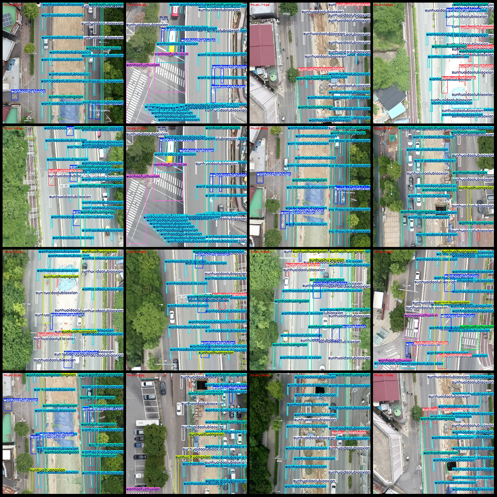
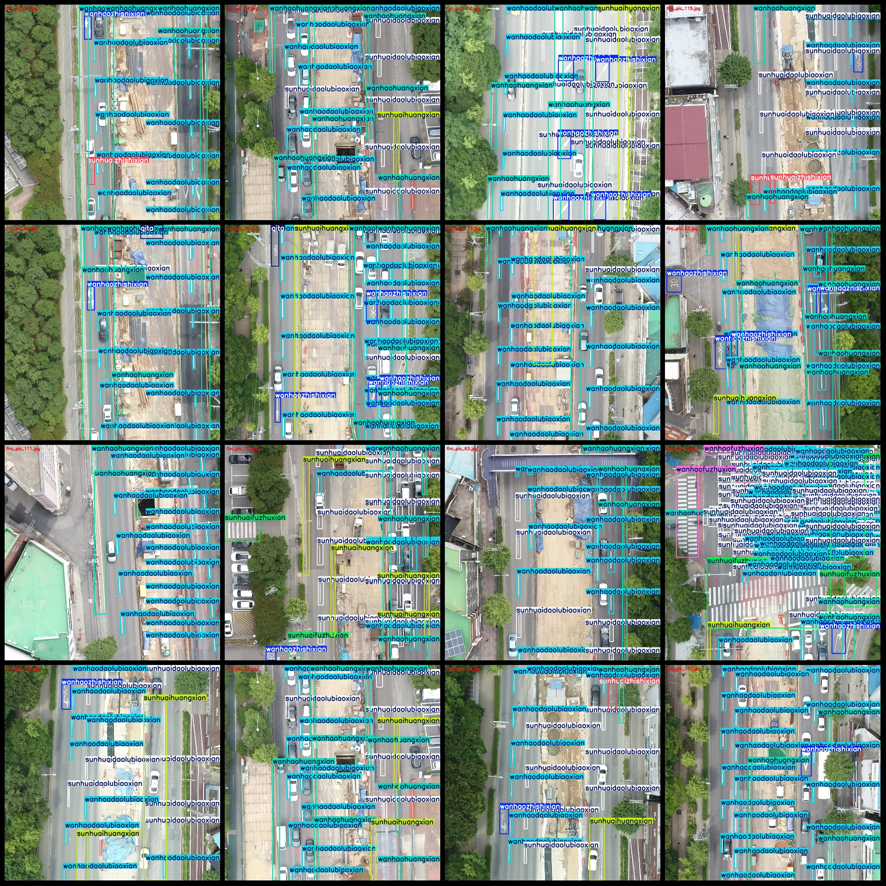

# Drone-Viewpoint Aerial Photography Roadway Marking Damage Evaluation and Detection Dataset (VOC+YOLO) Format, 175 Images in 9 Categories

Dataset format: Pascal VOC format + YOLO format (txt file without split path, only contains jpg images and corresponding VOC format xml file and yolo format txt file)
Number of images (total number of jpg files): 175
175
annotation count: 175  
Label the number of categories: 9
Annotation class names: ["Other", "Damaged Road Marking", "Damaged Auxiliary Line", "Damaged Yellow Line", "Damaged Indicating Line"]
1. Damage to road markings
2. Break the auxiliary line
3. Damage to the yellow line
4. Deterioration indicator
boxes per class:   
qita box count = 47  
sunhuaidaolubiaoxian frame count = 1116
sunhuaifuzhuxian box count = 70  
sunhuaihuangxian box count = 243  
Sunhuaizhishixian Frame Count = 104
wanhaodaolubiaoxian box count = 2634
wanhaofuzhuxian box count = 76  
"wanhaohuangxian box count = 633" is translated to English as "The number of frames in the Wanhao Huangxian video is 633."
wanhaozhishixian box count = 349  
Total frame count: 5272
Number of images per category:
"qita images = 31" is translated to English as "The number of images Qita owns is 31."
sunhuaidaolubiaoxian images = 154  
Sunhuaifuzuxian's possession of image count = 39
"sunhuaihuangxian images = 109" is translated to English as "The number of images Sunhuaihuangshan owns = 109."
Sunhuaizhishixian occupies a total of 62 images.
Number of pictures owned = 175
wanhaofuzhuxian images = 48  
Owning the Image Count = 159
wanhaozhishixian images = 138  
Image resolution: 1280x1280
Use the annotation tool: labelImg.
Rules for annotation: draw a frame around categories.
Important notes: Dataset does not have separate training, validation, and test sets.
Special Notice: This dataset does not guarantee the accuracy of the trained models or weight files.
Image Preview:
## Images

Here is a pay link on Stripe ( https://buy.stripe.com/3cs8yP7sY87d0vu9AB ). Please contact me lonlonago@foxmail.com after funding $89, and I will send you a complete data files , thank you!

